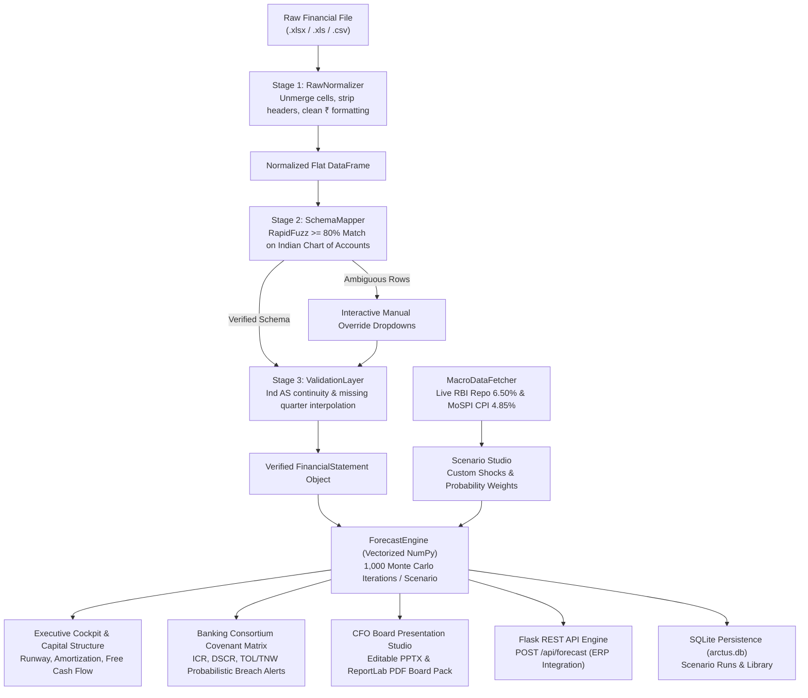

<div align="center">


### Institutional FP&A Stress-Testing & Executive Board Presentation Platform
*Engineered for Indian Mid-Market Corporates (₹25 Cr to ₹500 Cr)*

[](https://www.python.org/)
[](https://streamlit.io/)
[](https://flask.palletsprojects.com/)
[](#-automated-qa--test-suite)
[](#-indian-banking-consortium-covenants)
[-B49A5A?style=for-the-badge&labelColor=101722)](#-design-system--palette)

**Financial certainty, simulated in seconds.**  
Arctus replaces 2–3 days of fragile, formula-breaking Excel scenario planning with a 30-second automated, statistically rigorous Monte Carlo forecasting and AI Board Presentation engine tailored for Indian commercial banking covenants and Ind AS reporting standards.

[Key Capabilities](#-key-capabilities) • [Platform Architecture](#-system-architecture) • [Product Modules](#-core-product-workspaces) • [Quickstart](#-quickstart--installation) • [API Guide](#-programmatic-rest-api)

---

</div>

## 📌 Executive Summary & Problem Space

Indian mid-market companies in **Auto Ancillary, Specialty Chemicals, Industrial Manufacturing, and B2B SaaS** face aggressive macroeconomic volatility:
- **RBI Repo Rate Decisions** (floating working capital lines and term facility spreads)
- **Domestic Headline CPI & Wholesale Price Inflation** (MoSPI benchmarks)
- **Global Commodity Shocks** (crude oil derivatives, hot-rolled steel coil, ocean freight)
- **Consortium Loan Covenants** with private and public sector banks (SBI, HDFC, SIDBI)

### The Problem
Traditional finance teams spend **48–72 hours** hand-crafting static 3-scenario spreadsheets (`Base`, `Stress`, `Growth`). By the time the board deck is printed:
1. Macro assumptions are already out-of-date.
2. Cell formulas break with `#REF!` circular loops when custom ledger accounts or quarters are added.
3. No statistical confidence bands ($P_{10}$ to $P_{90}$) or probabilistic covenant breach signals exist.
4. CFOs spend hours converting numbers into presentation decks.

### The Arctus Solution
Arctus provides an end-to-end quantitative platform:
- **Zero-Friction Ingestion**: Ingests multi-sheet, unmerged, messy Indian P&L statements (`.xlsx`, `.csv`).
- **RapidFuzz Schema Mapping**: Automatically maps arbitrary ledger rows to standard Ind AS GAAP line items with manual override fallback.
- **In-Browser Financial Modeling Grid**: Editable spreadsheet table with real-time subtotal recalculations ($GP = \text{Rev} - \text{COGS}$, $EBITDA = GP - \text{OPEX}$).
- **Vectorized Monte Carlo Stress Engine**: 1,000 iterations per scenario across 4 forward quarters in $<1$ second.
- **Scenario Studio**: Unlimited custom scenario authoring with probability-weighted composite forecasting.
- **Debt Covenant Matrix**: Real-time evaluation of ICR ($\ge 2.0\text{x}$), DSCR ($\ge 1.25\text{x}$), Net Debt/EBITDA ($\le 3.0\text{x}$), and Current Ratio ($\ge 1.33\text{x}$) with Monte Carlo breach odds.
- **One-Click AI Board Presentation Generator**: Exports fully editable native PowerPoint decks (`.pptx`) and executive PDF board packs (`.pdf`) with 4-pillar narrative commentary and audit traceability.

---

## 🏛️ System Architecture



---

## 🚀 Core Product Workspaces

### 1. 📊 Executive Cockpit (`/overview`)
- **C-Suite Financial Health**: Trailing Twelve Months (TTM) annualized turnover and operating EBITDA run-rate.
- **Cash & Liquidity Runway**: Real-time months of defensive cushion factoring in liquid bank deposits and undrawn sanctioned CC/OD limits.
- **What-If Sensitivity Shocks**: Live sliders for RBI Repo shifts ($\pm 150\text{ bps}$), COGS inflation, and revenue drops with zero spreadsheet manipulation.
- **Consortium Loan Amortization Schedule**: Debt maturity profile from FY26 to FY29+.

### 2. 📝 Ingestion & Financial Modeling Studio (`/model`)
- **Interactive Spreadsheet Grid (`st.data_editor`)**: Edit historical quarters directly in the UI.
- **Add New Quarter**: Forward-project or backfill quarters with optional trend growth rates.
- **Add Custom Ledger Accounts**: Inject custom P&L sub-items (e.g. *R&D Software Subscriptions*, *Specialty Freight*).
- **One-Click Subtotal Recomputation**: Automatically reconciles:
  $$\text{Gross Profit} = \text{Revenue} - \text{COGS}$$
  $$\text{EBITDA} = \text{Gross Profit} - \text{OPEX}$$
- **Industry Presets**: One-click corporate models for **₹50 Cr Auto Ancillary**, **₹100 Cr Specialty Chemicals**, and **₹25 Cr B2B SaaS**.

### 3. 🎯 Scenario Studio (`/scenarios`)
- **Unlimited Custom Scenario Authoring**: Define tailored geopolitical, supply-chain, or financing shocks beyond fixed presets.
- **Curated Indian Industry Presets**:
  - *US Tariff & Export Surcharge Shock* ($-12\%$ Rev, $+8\%$ COGS, $1.25\times$ shock)
  - *Red Sea Freight & Logistics Spike* ($-4\%$ Rev, $+15\%$ COGS, $1.20\times$ shock)
  - *Domestic Steel & Commodity Surge +25%* ($-2\%$ Rev, $+22\%$ COGS, $1.15\times$ shock)
  - *SBI Consortium Capex Expansion* ($+24\%$ Rev, $+6\%$ COGS, $+18\%$ OPEX, $1.35\times$ shock)
  - *IT Services Bench & Margin Crunch* ($-15\%$ Rev, $+2\%$ COGS, $+10\%$ OPEX, $1.10\times$ shock)
- **Probability Weighting & Blended Composite Forecasts**: Allocate likelihood percentages (e.g. $20\%$ Recession, $60\%$ Base, $20\%$ Growth) to compute blended expected trajectories:
  $$\text{Blended Metric}_t = \sum_{s} w_s \cdot \text{Metric}_{s, t}$$
- **Mixture Monte Carlo Sampling**: Blends 1,000 randomized draws to evaluate composite Value-at-Risk ($P(\text{EBITDA} < 0)$).

### 4. 🏦 Stress Test & Debt Covenant Matrix (`/covenants`)
- **Indian Banking Consortium Sanctions**:
  - **Interest Coverage Ratio (ICR)**: Bank Sanction Benchmark $\ge 2.00\text{x}$ (SBI / HDFC Consortium Norm)
  - **Debt Service Coverage Ratio (DSCR)**: Benchmark $\ge 1.25\text{x}$ (Term Loan Amortization Norm)
  - **Total / Net Debt to EBITDA Multiple**: Maximum Leverage Ceiling $\le 3.00\text{x}$
  - **Working Capital Current Ratio**: Benchmark $\ge 1.33\text{x}$ (RBI Tandon / Nayak Committee Norm)
  - **Total Outside Liabilities to Tangible Net Worth (TOL/TNW)**: Solvency Cap $\le 2.50\text{x}$
- **Monte Carlo Probabilistic Breach Alerts**:
  > *"14.2% risk of ICR breaching the 2.00x bank sanction threshold in Q3 FY25."*
- **Consortium Compliance Memorandum Generator**: Pre-formatted credit committee briefing with one-click `.txt` download for bank syndication reviews.

### 5. 📑 CFO Executive Board Presentation Studio (`/board_presentation`)
- **One-Click AI Board Pack Dual Export**:
  - **Fully Editable PowerPoint (`.pptx`)**: Native 16:9 widescreen slides with native, editable tables, metric callout cards, and vector shapes.
  - **Executive PDF Board Pack (`.pdf`)**: Corporate landscape document rendered via ReportLab ready for print and C-suite distribution.
- **AI Narrative (4-Pillar Executive Framework)**:
  1. *What Happened* (Quarterly performance summary)
  2. *Why It Happened* (Operational root causes and mix shifts)
  3. *Financial Impact* (Cushion above covenants, runway impact)
  4. *Management Action* (Concrete forward mitigations and indexing clauses)
- **Multi-Audience Framing**: Toggle narrative tone between **Board of Directors**, **Lenders / Consortium**, and **Investors & PE**.
- **Design & Theme Studio**: Choose between *Executive Gold & Navy (Arctus Signature)*, *Corporate Slate & Steel*, *Investor Minimalist Ivory*, and *Lender Consortium Blue*.
- **Smart Pre-Flight QA**: Cross-checks mathematical consistency and verifies calculation integrity before export.
- **Source Traceability Drill-Down**: Every KPI maps directly to underlying financial rows, formulas, and verification tags.
- **AI Slide Editor Commands**: One-click natural language prompts (*"Make this more concise"*, *"Rewrite for lenders"*, *"Highlight margin compression"*).

### 6. 🌐 Public Experience & Client Onboarding
- Public showcase realm (`Home` $\to$ `How It Works` $\to$ `Product` $\to$ `Login` $\to$ `Register`).
- Light & Dark mode support with instant theme switching.
- Guided 3-step onboarding walkthrough modal for first-time CFO users.

---

## 🎨 Design System & Palette

Arctus adheres to a cohesive executive aesthetic:

| Token | Dark Mode (Default) | Light Mode | Description |
|:---|:---|:---|:---|
| **Base Background** | `#101722` | `#F4F1E8` | Obsidian Navy / Warm Ivory Cream |
| **Surface Card** | `#16202E` | `#FFFFFF` | Elevated Navy Surface / Crisp White Card |
| **Signature Accent** | `#B49A5A` | `#B49A5A` | Antique Champagne Gold |
| **Accent Hover** | `#C5AC6C` | `#C5AC6C` | Bright Antique Gold |
| **Text Primary** | `#F4F1E8` | `#101722` | Warm Alabaster / Deep Navy |
| **Growth Scenario** | `#7A9B76` | `#7A9B76` | Muted Sage Green |
| **Stress Scenario** | `#B5545A` | `#B5545A` | Dusty Brick Red |
| **Typography** | `DM Sans` | `DM Sans` | Premium Corporate Display & Body |
| **Monospace / Figures** | `Geist Mono` | `Geist Mono` | High-Precision Tabular Financials |

All figures follow Indian comma grouping notation (`₹ 12,34,567.89`) with toggle support for **Lakhs (L)** and **Crores (Cr)**.

---

## ⚡ Quickstart & Installation

### Prerequisites
- Python 3.11, 3.12, or 3.13
- Windows PowerShell, macOS Terminal, or Linux Bash

### 1. Clone Repository & Setup Environment
```bash
git clone https://github.com/your-username/arctus.git
cd arctus

# Create and activate virtual environment
python -m venv .venv

# On Windows (PowerShell):
.\.venv\Scripts\Activate.ps1

# On macOS / Linux:
source .venv/bin/activate
```

### 2. Install Dependencies
```bash
pip install -r requirements.txt
```

### 3. Launch Platform
Run the single unified launcher (spins up both Streamlit and Flask API concurrently):
```bash
python run.py
```
- **Web Platform**: [http://localhost:8501](http://localhost:8501)
- **REST API Endpoint**: [http://localhost:5000](http://localhost:5000)

*Instant Demo Access:* Navigate to `http://localhost:8501/?page=overview` for immediate demo credentials.

---

## 🧪 Automated QA & Test Suite

Arctus maintains **100% test pass rate** with 50 automated unit, integration, and mathematical integrity tests.

```powershell
.\.venv\Scripts\python -m pytest tests/
```

### Test Coverage Breakdown:
```text
tests/test_api.py ................ [Flask REST API endpoints & payload validation]
tests/test_board_presentation.py .. [Editable PPTX, ReportLab PDF & Pre-flight QA]
tests/test_cockpit.py ............. [Executive Cockpit, Runway & Amortization]
tests/test_covenants_page.py ...... [Banking Consortium Benchmarks & Monte Carlo Breach]
tests/test_engine.py .............. [Vectorized NumPy Forecast & Monte Carlo Simulation]
tests/test_mapper.py .............. [RapidFuzz Indian Schema Ingestion Mapping]
tests/test_model_page.py .......... [Spreadsheet Grid Roundtrip & Subtotal Derivation]
tests/test_normalizer.py .......... [Multi-sheet Excel Parser & ₹ Currency Cleaning]
tests/test_public_pages.py ........ [Public Landing, Themes, Auth & Navigation Routes]
tests/test_scenarios_studio.py .... [Custom Scenarios, SQLite Persistence & Mixture Forecast]
tests/test_validator.py ........... [Ind AS Accounting Sanity & Timeline Interpolation]

============================= 50 passed in 6.63s =============================
```

---

## 🔌 Programmatic REST API

Arctus provides an embedded background REST service for enterprise ERP integration (SAP S/4HANA, TallyPrime, Zoho Books):

### Endpoint: `POST /api/forecast`
```bash
curl -X POST http://localhost:5000/api/forecast \
  -H "Content-Type: application/json" \
  -d '{
    "periods": ["Q1 FY24", "Q2 FY24", "Q3 FY24", "Q4 FY24"],
    "revenue": [125000000, 131000000, 128000000, 142000000],
    "cogs": [75000000, 78600000, 76800000, 85200000],
    "opex": [27500000, 28820000, 28160000, 31240000],
    "scenarios": [
      {
        "name": "Consortium Stress Case",
        "rev_growth": -0.06,
        "cogs_inflation": 0.08,
        "opex_inflation": 0.05,
        "macro_shock": 1.25,
        "probability_weight": 0.30
      }
    ],
    "iterations": 1000
  }'
```

### Response Payload:
```json
{
  "status": "success",
  "forecast_periods": ["Q1 FY25", "Q2 FY25", "Q3 FY25", "Q4 FY25"],
  "results": {
    "Consortium Stress Case": {
      "point_forecast": {
        "revenue": [128823529.41, 126909848.24, 125024479.35, 123167098.41],
        "ebitda": [20184000.00, 19245000.00, 18340000.00, 17468000.00]
      },
      "confidence_bands": {
        "ebitda": {
          "p10": [17850000.00, 16920000.00, 16010000.00, 15120000.00],
          "p50": [20180000.00, 19240000.00, 18340000.00, 17460000.00],
          "p90": [22510000.00, 21560000.00, 20670000.00, 19800000.00]
        }
      },
      "loss_probability": 0.0,
      "covenants": {
        "icr": { "actual": 2.84, "threshold": 2.00, "status": "compliant" },
        "dscr": { "actual": 1.48, "threshold": 1.25, "status": "compliant" }
      }
    }
  }
}
```

---

## 🗺️ Roadmap & Upcoming Milestones

- [x] **Stage 1 & 2 Financial Ingestion Pipeline** (RawNormalizer & SchemaMapper)
- [x] **Ind AS Continuity & Validation Layer** (Timeline interpolation & GAAP identities)
- [x] **Vectorized Monte Carlo Forecasting Engine** (1,000 iterations & tornado sensitivity)
- [x] **Executive Cockpit & Capital Structure Modeler** (Cash runway & debt maturity)
- [x] **In-Browser Financial Modeling Grid** (`st.data_editor` with real-time subtotal formulas)
- [x] **Macro Scenario Studio** (Custom scenarios & probability-weighted composite forecasting)
- [x] **Indian Banking Consortium Covenant Matrix** (ICR, DSCR, Net Debt/EBITDA, TOL/TNW breach odds)
- [x] **One-Click AI Board Presentation Studio** (Editable PPTX & ReportLab PDF with 4-pillar narrative)
- [ ] **Direct ERP Webhooks** (Two-way automatic sync with TallyPrime and Zoho Books)
- [ ] **Automated Bank Consortium Email Dispatch** (Encrypted scheduled compliance report delivery)

---

## 📄 License & Attribution

Distributed under the **MIT License**. Built with precision for CFOs, FP&A directors, and corporate finance advisors.

<div align="center">
<sub>Designed and Developed with <b>Arctus Black & Gold Elegance</b>. All rights reserved.</sub>
</div>
